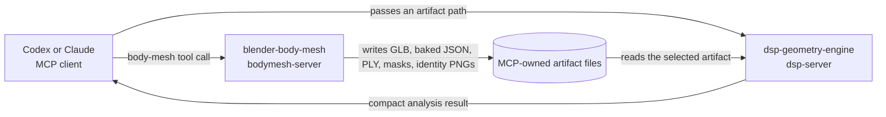

# DSP-Geometry-Engine

An LLM cannot, inside its context window, traverse a 75k-vertex adjacency array, unwrap and
differentiate a phase spectrum, integrate a BRDF over the hemisphere, or take the rank of a
controllability matrix. It *can* read a one-line verdict. This repository is that translation layer:
MCP tools that do the mechanical math on data already sitting on disk and hand back a compact JSON
summary — a number, a boolean, a ranked list — small enough for a model to reason about. Arrays never
cross the MCP boundary; the full spectra, plots, models, and images stay under `data/`.

It ships **two independent MCP servers**. `dsp-geometry-engine` is a DSP microscope over mesh dumps,
renders, and telemetry (49 tools in 11 packs). `blender-body-mesh` is a local Blender/MPFB
character-generation server (6 tools). They are separate processes with separate tool lists; the
client, not the servers, moves artifacts between them.

**The private C++ renderer is not required.** Exactly one of the 49 DSP tools shells out to it
(`extract_mesh_telemetry`, `src/dsp_server/toolsets/geometry.py:107` — the only `engine_cli` call site
in the tree). The other 48 read `.ply`, `.csv`, `.npz`, `.json`, and image files off disk and are pure
Python. A bundled stub CLI covers even that one: see
[Run it without the engine](#run-it-without-the-engine).

## Status

v0.1.0. 348 tests, all passing, none of which need the C++ engine. The corrugation RCA that motivated
the project is concluded: the forearm ripple is 118–123 cycles/meter (~8.4 mm, the mesh edge-loop
spacing, ~20 dB prominence), it is present identically in the source mesh's bind positions, and the
renderer's capsule welds, flexion deformers, and retargeted weights were exonerated — the defect
originates upstream in a Blender retarget/bake step. The tools outlived the bug they were built for.

## Requirements

**`dsp-geometry-engine`** — Python 3.12 and [uv](https://docs.astral.sh/uv/). That is the whole list.
Every dependency is a pure-wheel install (numpy, scipy, matplotlib, pillow, sympy, scikit-learn,
pywavelets, `mcp[cli]`); there is no torch and no model weights to download — even the perceptual
FR-VQA pack is pure scipy. Optionally `DSP_ENGINE_ROOT` pointing at a build of the separate, private
C++ renderer, which unlocks `extract_mesh_telemetry` against real engine dumps.

**`blender-body-mesh`** — additionally needs, and none of these are bundled here:

| Needed | Why |
| --- | --- |
| Windows | Every path default in `src/bodymesh_server/config.py` is a Windows location; all are env-overridable, but the lane has only been exercised there. |
| Blender 4.2 (`blender.exe`, never `blender-launcher.exe`) | The worker scripts run inside it. |
| MPFB 2.0.x, installed as a Blender extension | The only supported body backend. MB-LAB is reported by discovery and never invoked. |
| `skeleton_male.json` / `skeleton_female.json` | The 55-bone engine-canonical rig the retarget targets. Set `BODYMESH_ENGINE_SKELETON_DIR`. |
| A built `character_bake_cli.exe` | Bakes a completed candidate into an engine character. Set `BODYMESH_CHARACTER_BAKE_EXE`. |

`inspect_bodymesh_runtime` is a zero-cost pre-flight for exactly this: it creates nothing, launches
nothing, and names every missing artifact by absolute path (`Blender executable is missing…`,
`MPFB 2.0.x was not detected…`, `engine skeleton assets are missing: <paths>`,
`character_bake_cli is missing: <path>`). Run it first — see
[Command-line entrypoints](#command-line-entrypoints).

## Quickstart

```powershell
uv sync            # install (Python 3.12, locked deps)
uv run pytest      # full suite — runs against the bundled stub engine, no C++ needed
```

## Run it without the engine

`tests/stub_engine.py` honors the real dump CLI's argument grammar, exit codes, and stderr protocol,
and writes a 64×16 synthetic forearm cylinder with a 60 cycles/meter ripple injected at 2 mm
amplitude (`tests/stub_engine.py:26-27`). Pointing `DSP_ENGINE_CLI` at it exercises discovery, feature
detection, teeing, and stderr parsing end to end — the whole engine path minus the C++.

The tools' implementations are plain module-level functions; the MCP server and the tests both call
them 1:1, so an example needs no MCP client. Do **not** start `dsp-server` by hand for this.

```powershell
# 1. Point the bridge at the stub. Absolute, because the bridge — not your shell —
#    resolves this path, and a .py suffix means "run through the current interpreter".
$env:DSP_ENGINE_CLI = "$PWD/tests/stub_engine.py"

# 2. Dump a posed mesh.
uv run python -c "from dsp_server.toolsets import AppContext, geometry; ctx = AppContext.from_config(); print(geometry._extract_mesh_telemetry(ctx, pose_clip='clip-cin-walktalk', label='demo'))"
```

Real output, abridged (absolute paths shortened, `bone_map`/`stderr_tail`/`engine_stale` dropped):

```json
{"ply_path":"…/data/dumps/demo_clip-cin-walktalk_20260731-151117.ply",
 "meta_path":"…/data/dumps/demo_clip-cin-walktalk_20260731-151117.meta.json",
 "palette_path":"…/data/dumps/demo_clip-cin-walktalk_20260731-151117.palette.json",
 "duration_s":0.203,"vertex_count":1024,"face_count":2016,"bone_count":11,
 "clip_id":"clip-cin-walktalk","sample_time":0.0,"collision_push":0.0012,
 "baked_collision_push":0.0,"imported":false,"has_weights":true,
 "arm_chain_histogram":{"armUpperL (4)":16,"armLowerL (5)":992,"handL (6)":16}}
```

Now feed that PLY to the analysis half — this tool never touches the engine, it only reads the file:

```powershell
# 3. Analyze the forearm segment (substitute the ply_path printed above).
uv run python -c "from dsp_server.toolsets import AppContext, geometry; ctx = AppContext.from_config(); print(geometry._analyze_corrugation(ctx, dump=r'data/dumps/demo_clip-cin-walktalk_20260731-151117.ply', joint='armLowerL'))"
```

Real output, abridged (`dump_path`, `diff1_var`, `diff2_var`, `plot_path`, and four of the five
`spectral_peaks` dropped):

```json
{"joint":"armLowerL","joint_ids":[5],"channel":"posed","vertex_count":992,"n_samples":256,
 "t_span_m":0.217407,
 "roughness":{"rms_ripple_m":0.00123165,"rel_ripple":0.0307911,"hf_energy_ratio":0.998741,
              "dominant_freq_cpm":59.5622,"dominant_wavelength_m":0.0167892,
              "peak_prominence_db":45.7819,"ridge_count_est":13,
              "sector_phase_coherence":1.0,"corrugated":true},
 "spectral_peaks":[{"freq_cpm":59.5622,"prominence_db":45.767}],
 "extent_t_start_m":-0.108703,"extent_t_end_m":0.108704,"extent_band_energy_fraction":0.914806}
```

`dominant_freq_cpm` 59.5622 recovers the 60 cycles/meter the stub injected, at 45.8 dB prominence,
verdict `corrugated: true`. That closed loop — synthesize a known defect, measure it back — is what
the 48 file-reading tools do against real data.

> On Windows, `uv run` re-syncs the virtualenv and will fail with `os error 32` if a registered MCP
> stdio server is holding `.venv/Scripts/*.exe`. Use `uv run --no-sync …` in that situation.

## MCP registration

The client registrations are **not tracked** — they contain machine-specific absolute paths and a
committed copy fails hard on any clone. Copy the templates and edit them:

```powershell
Copy-Item .mcp.json.example .mcp.json                       # Claude Code
Copy-Item .codex/config.toml.example .codex/config.toml     # Codex
```

Then edit the paths. In `.mcp.json`, also delete the `_comment` key — strict JSON has no comment
syntax. Both templates document every environment variable inline; every one is optional, and
deleting a line falls back to the in-code default. If you have no Blender/MPFB install, delete the
whole `blender-body-mesh` entry — the DSP server is unaffected. For Claude Desktop, run
`scripts/register-claude-desktop.ps1`, which derives the repo root from its own location and merges
both entries into `claude_desktop_config.json` without clobbering sibling servers.

After adding or changing a registration, restart the client and open a fresh task in this project.
**Never start `dsp-server` or `bodymesh-server` by hand inside a session that already registered
them** — an extra stdio instance sits waiting for JSON-RPC on a pipe nobody is writing to and looks
hung.

## Two MCP servers, one client workflow

Their registered names and executable entrypoints are different:

| Registered MCP name | Executable | Responsibility | Current runtime |
| --- | --- | --- | --- |
| `dsp-geometry-engine` | `dsp-server` | DSP, imaging, geometry, engine telemetry, and the other analysis tool packs | Local stdio or streamable HTTP (authenticate when exposed) |
| `blender-body-mesh` | `bodymesh-server` | Private-photo job preparation, Blender/MPFB body generation, engine rigging, character baking, and identity renders | Local stdio only |

Some diagnostics may also show the internal FastMCP display titles `DSP-Geometry-Engine` and
`Blender-BodyMesh`. The lowercase names in the table are the canonical client registration keys.

Loading both registrations in Codex or Claude does **not** combine them into one process. The MCP
client starts and talks to each server separately. They have separate tool lists, configuration,
subprocesses, logs, failure boundaries, and deployment requirements.



There is no MCP-to-MCP call between the two servers. The client performs the orchestration: it calls
one server, receives artifact paths, and supplies a selected path to a tool on the other server.

The body-mesh MCP creates bounded MPFB candidates from explicit parameters, retains front/side image
references, renders comparison silhouettes, and exports both neutral DSP telemetry and an engine-ready
55-bone arms-down GLB/baked character with skin weights and tangents. For a completed candidate it can
also render the fixed eight-closeup/three-body-view `identity-v1` set without changing the candidate
contract. It does not claim one-shot photo reconstruction — fitting a body to photographs is an
iterative parametric approximation, and a single clothed image is underdetermined. See
[`docs/BODY-MESH-MCP.md`](https://github.com/hgner/hippocampus/blob/main/docs/BODY-MESH-MCP.md).

## Tool packs

The following 49 tools and 11 packs belong only to `dsp-geometry-engine`; they are not part of
`blender-body-mesh`. The packs cover the engine's own DSP lane, one pack per relevant EE course, a
rendering lane for the ray tracer, a video lane for the AI-video comparison gate, and a perceptual
FR-VQA lane. Each pack registers by default; trim per client with the `DSP_TOOLSETS` environment
variable (comma-separated names). General data goes in as
`.csv/.tsv/.json/.npz/.npy` paths (column-addressed); `.ply` paths address engine dumps as
`column="<joint>[:posed|rest]"`; video tools take a directory or list of frame images.

| Pack (`DSP_TOOLSETS` name) | Course / lane | Tools |
| --- | --- | --- |
| `geometry` | ELE407 DSP + mesh QA | `extract_mesh_telemetry`, `analyze_corrugation`, `compare_geometry_signals`, `localize_defect`, `lbs_differential`, `score_bake`, `analyze_mesh_topology` |
| `imaging` | ELE490 Image Processing | `compare_depth_renders`, `enhance_image`, `filter_image`, `segment_image`, `restore_image`, `compare_wavelet_signatures` |
| `stats` | ELE320 Probability & Statistics | `describe`, `fit_distribution`, `hypothesis_test`, `regression_fit`, `compare_dump_ripples` |
| `engmath` | MAT235/236 Engineering Math | `solve_ode`, `laplace_transform`, `linear_algebra`, `residues_and_integrals`, `fourier_series` |
| `systems` | ELE301 Signals & Systems + control | `lti_response`, `pole_zero`, `bode`, `sampling_check`, `convolve_signals`, `group_delay`, `state_space_analysis` |
| `ml` | ELE489 Machine Learning | `feature_engineer_dump`, `cluster`, `reduce_dims`, `classify_eval`, `predict` |
| `netqueue` | ELE412 Data Communication | `queueing_calc`, `little_law`, `erlang_blocking` |
| `os` | Operating Systems (Tanenbaum) | `schedule_sim`, `page_replacement_sim`, `bankers_check` |
| `rendering` | PBR / ray-tracer energy | `verify_brdf_energy` |
| `video` | AI-video comparison gate | `evaluate_spatiotemporal_frequencies`, `verify_motion_consistency`, `verify_camera_projection`, `analyze_photometric_consistency`, `evaluate_occlusion_boundaries` |
| `perceptual` | Perceptual / semantic FR-VQA (classical) | `evaluate_perceptual_similarity`, `verify_identity_coherence` |

All tools return small JSON summaries; arrays, plots, models, and images stay on disk under `data/`
(`plots/`, `series/`, `images/`, `features/`, `models/`, `brdf/`, `video/`, `perceptual/`). Preset examples:
`DSP_TOOLSETS=geometry,imaging,stats` for a corrugation-RCA session; `DSP_TOOLSETS=engmath,systems,stats`
for coursework-style calculation; `DSP_TOOLSETS=geometry,rendering` for engine mesh + shader QA;
`DSP_TOOLSETS=video,imaging,geometry,perceptual` for the full AI-video generation comparison gate
(math + perceptual).

## Command-line entrypoints

Two console scripts (`[project.scripts]` in `pyproject.toml`) run a single tool without an MCP client,
for callers that spawn helpers and parse JSON. Both print the tool's exact JSON envelope on stdout.

`dsp-tool` exposes the comparison-gate subset of the DSP tools over the same `_impl` functions the MCP
server registers. Naming a tool it does not carry prints the roster:

```powershell
uv run dsp-tool no_such_tool
```

```json
{"error": "unknown tool 'no_such_tool'", "hint": "available: ['analyze_photometric_consistency', 'compare_wavelet_signatures', 'evaluate_occlusion_boundaries', 'evaluate_perceptual_similarity', 'evaluate_spatiotemporal_frequencies', 'score_bake', 'verify_camera_projection', 'verify_identity_coherence', 'verify_motion_consistency']"}
```

A real call takes the tool's arguments as one JSON object. Exit code 0 means the tool ran — a
tool-level error is still valid JSON on stdout, carrying `error` and a `hint`; exit 2 means an unknown
tool or malformed arguments:

```powershell
uv run dsp-tool verify_motion_consistency --args-json '{\"frames\": \"data/video/no-such-clip\"}'
```

```json
{"error":"VideoError: no frames matched 'data/video/no-such-clip' (pass a directory, a glob, or a path list)","hint":"pass a directory of same-size frames or an explicit path list (>= 2 frames); grid_step/window control the flow grid and Lucas-Kanade window size","stderr_tail":null}
```

(The backslash-escaped quotes are a Windows PowerShell 5.1 requirement — it strips inner double quotes
when handing an argument to a native executable, and the CLI then rejects the JSON. POSIX shells take
`'{"frames": "..."}'` verbatim.) See [`docs/COMPARISON-GATE.md`](https://github.com/hgner/hippocampus/blob/main/docs/COMPARISON-GATE.md) for what the
gate tools measure and how their verdicts combine.

`bodymesh-tool` exposes all 6 body-mesh tools the same way. The pre-flight needs no arguments and
touches nothing:

```powershell
uv run bodymesh-tool inspect_bodymesh_runtime
```

Real output from a fully provisioned machine, abridged (absolute paths shortened, `blender_shortcut`
and the MB-LAB `addons` entry dropped, MPFB's `enabled_hint`/`path` dropped, its `note` truncated at
the ellipsis):

```json
{"blender_executable":"C:/Program Files/Blender Foundation/Blender 4.2/blender.exe",
 "blender_exists":true,"data_dir":"…/data/bodymesh","input_roots":["…/data/bodymesh/inbox"],
 "engine_skeleton_dir":"…","character_bake_executable":"…/character_bake_cli.exe",
 "engine_contract_available":true,
 "addons":[{"backend":"mpfb","installed":true,"version":"2.0.16","supported":true,
            "note":"Primary backend: the only body generator this MCP invokes, driven headlessly
                    through the confined Blender worker. Licensing of MPFB, its bundled assets, and
                    anything generated with them is the operator's to determine …"}],
 "supported_backend":"mpfb","execution_mode":"local-stdio/background-subprocess","warnings":[]}
```

The server makes no claim about MPFB's own terms — determine them from the installed extension.

On a machine without Blender, MPFB, the skeleton JSONs, or the bake exe, the same call returns
`blender_exists: false` / `engine_contract_available: false` and one `warnings` entry per missing
artifact, each naming the path it looked at.

## Docs

- `docs/ENGINE-PLAYBOOK.md` — **when/where to reach for each tool in an engine-debugging session** (advisory).
- `docs/COMPARISON-GATE.md` — **the AI-video comparison gate**: symptom→tool, how the per-tool verdicts combine into one clip pass/fail, and the honest caveats (proven end-to-end in `tests/test_comparison_gate_e2e.py`).
- `docs/ARCHITECTURE.md` — dual-server topology, related repositories, tool surfaces, and isolation logic.
- `docs/BODY-MESH-MCP.md` — separate Blender server, cross-server handoff, rig contract, and troubleshooting.
- `docs/DEVELOPMENT.md` — setup, lint/test, engine build lane, MCP registration, adding a course pack.
- `docs/DEPLOYMENT.md` — DSP-server-only container/AWS deployment, env var reference, and security.
- `LICENSES/README.md` — the directory-scoped license map and why the Apache/GPL split holds.
- `llms.txt` — canonical rules for LLM agents working in this repo (imported by `CLAUDE.md`).

## License

Apache-2.0, with one directory-scoped carve-out: everything under
`src/bodymesh_server/blender_scripts/**` is GPL-3.0-or-later, because those files execute inside
Blender and reach MPFB's GPL service API. The distribution as a whole is
`Apache-2.0 AND GPL-3.0-or-later`, which is the SPDX expression in `pyproject.toml`.

The split holds because the boundary is a process boundary, not a link: `bodymesh_server` launches the
workers via `subprocess.Popen(argv, shell=False)` and only request/result JSON and filesystem paths
cross. No worker imports a project module, and MPFB is reached through `importlib.import_module` at
runtime. Neither Blender nor MPFB is bundled here or in any wheel built from this repository.

See [`LICENSE`](https://github.com/hgner/hippocampus/blob/main/LICENSE),
[`NOTICE`](https://github.com/hgner/hippocampus/blob/main/NOTICE), and
[`LICENSES/README.md`](https://github.com/hgner/hippocampus/blob/main/LICENSES/README.md) for the
full map, the third-party dependency notes, and the copyright statement.

Copyright 2026 hgner <hgner09@gmail.com>.
