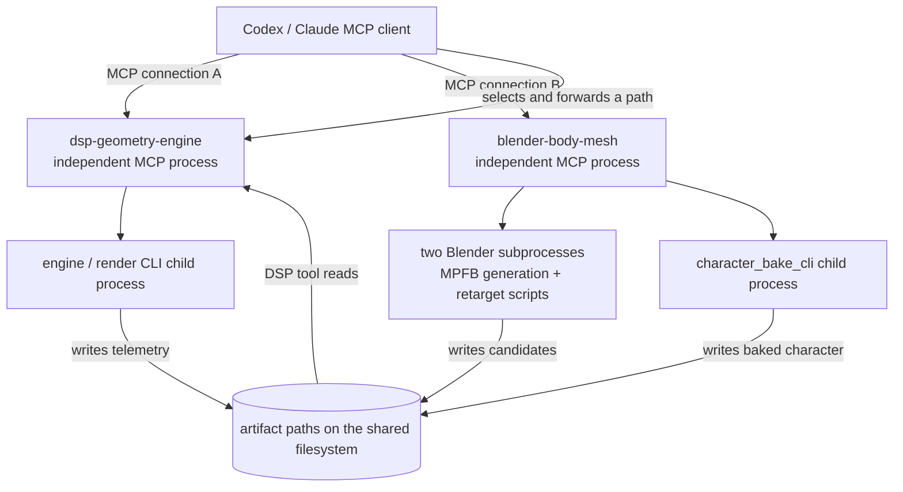

# Architecture

## Repository purpose

This repository contains two MCP servers. The primary `dsp-geometry-engine` server gives Claude a
quantitative instrument for mesh-space defect hunting; the separate `blender-body-mesh` server
creates Blender/MPFB character artifacts that can later enter that analysis lane. The C++ engine
(proje7-engine) can dump a posed, skinned, deformed character surface as an ASCII PLY. The DSP server
drives that CLI, reduces the 3D vertex cloud to 1D axial signals per bone segment, and applies
classical DSP (detrending, zero-phase IIR/FIR filtering, PSD/Welch spectra,
peak prominence), and returns compact JSON verdicts. The concrete mission is the corrugation defect
on the forearm of the imported `cc0_male_rigged3` character: periodic radial rippling along the
forearm under flexion, originally observed in depth renders. The DSP server exists so an LLM can
measure
the defect (frequency, wavelength, extent, phase coherence) instead of eyeballing it, and can
attribute it (skin weights vs engine deformers vs render-side) via a dual-telemetry differential.

## Runtime topology and ownership

The shared repository and shared client session are packaging conveniences, not a nested runtime.
Each registration launches its own operating-system process and establishes its own MCP connection.

| Boundary | `dsp-geometry-engine` | `blender-body-mesh` |
| --- | --- | --- |
| Python entrypoint | `src/dsp_server/server.py` via `dsp-server` | `src/bodymesh_server/server.py` via `bodymesh-server` |
| Tool ownership | 49 analysis tools across 11 toolset packs | 6 body-generation/job tools |
| Child processes | Engine/render CLIs when a selected tool needs them | Two `blender.exe` subprocesses (MPFB generation script, then retarget script), followed by `character_bake_cli` |
| Primary files | `data/dumps`, caches, plots, images, models, and reports | `data/bodymesh/jobs` references, candidates, masks, GLB, and baked JSON |
| Transport | stdio locally; optional authenticated streamable HTTP | stdio locally only |
| Failure scope | A DSP-server failure does not terminate bodymesh-server | A Blender/bodymesh failure does not terminate dsp-server |



There is intentionally no `DSP`↔`Body` MCP edge in the diagram.

The servers do not discover or invoke one another. A cross-server workflow exists only because the
client can take a path returned by one tool and use it as an argument to another tool. This keeps the
Blender/private-photo execution boundary out of the analysis server and its cloud deployment.
`bodymesh-server` does reuse the pure `dsp_server.engine.ply` parser as an in-process library for PLY
validation; importing that library does not create, discover, or call a `dsp-server` MCP connection.

## Data flow

The following is specifically the `dsp-geometry-engine` analysis path.

Arrays never cross the MCP boundary. Every tool response is a small pydantic JSON document; vertex
arrays, spectra, and plots live on disk under `data/`.

```
+--------+   MCP (stdio local /            +------------+
| Claude | <--streamable HTTP cloud------> | dsp-server |
+--------+   compact JSON only             +-----+------+
                                                 | subprocess (cxx_bridge/engine_cli.py)
                                                 v
                                  layered_field_dump_cli.exe        (proje7-engine, build/<preset>/)
                                                 |
                                     data/dumps/*.ply  (+ .meta.json, .palette.json; stderr -> data/logs/)
                                                 |
                                       numpy parse (engine/ply.py, .npz cache in data/cache/)
                                                 |
                              segment select -> axis fit -> 1D axial profile (engine/transforms.py)
                                                 |
                                  FFT / roughness / filters (engine/filters.py, scipy)
                                                 |
                                    pydantic JSON summary  --------> back over MCP to Claude
                                    (optional PNG plot saved to data/plots/, path returned)
```

## Related repositories

| Repo | Role | CI |
| --- | --- | --- |
| `proje10` (this repo) | Two Python MCP entrypoints: DSP analysis plus local Blender body generation; bridges, math, tests, and docs | GitHub Actions (ruff + pytest + stub engine, ubuntu + windows; DSP-only docker build) |
| `proje7-engine` | C++ engine worktree (branch `engine`); owns `layered_field_dump_cli` | Local-only: PowerShell scripts (`scripts/verify-engine.ps1`) |
| `proje8` | Default source of authoritative `scripts/blender/skeleton_{sex}.json` files and a separate video pipeline | External local dependency; not modified by proje10 CI |

proje10 finds the engine via `DSP_ENGINE_ROOT` — the root of a proje7-engine checkout, defaulting to
a sibling directory next to this repo (derived from the package's own location, so it is a guess any
other layout must override) — and looks for exes under
`build/<preset>/`, never `build/bin`. `DSP_ENGINE_CLI` overrides discovery
with a single explicit path (a `.py` path runs via the current interpreter — that is how CI swaps in
`tests/stub_engine.py`). Only `extract_mesh_telemetry` consults either variable; the remaining 48
tools never touch the engine. CI never touches the C++ repo; the real-engine lane is local PowerShell.
The body-mesh server resolves skeleton files through `BODYMESH_ENGINE_SKELETON_DIR`, validates one at
job preparation, and snapshots it into the job. It reads the configured file; it does not launch the
proje8 application or create an MCP connection to that repository.

## Components

### Console entrypoints (`pyproject.toml` `[project.scripts]`)

| Script | Module | Role |
| --- | --- | --- |
| `dsp-server` | `dsp_server.server:main` | The `dsp-geometry-engine` MCP process (stdio or streamable HTTP). |
| `dsp-tool` | `dsp_server.tool_cli:main` | Runs one registered DSP tool from a shell and prints its JSON — calls the same module-level `_impl` the MCP tool wraps, so CI/cron/scripts get the tool surface without speaking MCP. |
| `bodymesh-server` | `bodymesh_server.server:main` | The `blender-body-mesh` MCP process (stdio, local only). |
| `bodymesh-tool` | `bodymesh_server.tool_cli:main` | The same one-shot CLI counterpart for the six body-mesh tools. |

### `dsp_server` core

| Component | Responsibility |
| --- | --- |
| `server.py` | FastMCP entrypoint; builds `AppContext`, registers toolset packs, selects transport (`DSP_TRANSPORT`); the HTTP transport is fail-closed on `DSP_AUTH_TOKEN` behind a bearer ASGI middleware. |
| `config.py` | All env knobs (`DSP_*`), data-dir layout, engine discovery roots, transport/auth selection. |
| `schemas.py` | Shared pydantic v2 response models; `extra="forbid"`; 6-sig-fig rounding; the `ToolError{error, hint, stderr_tail}` envelope. |
| `plots.py` | Agg-locked matplotlib (`matplotlib.use("Agg")` before pyplot imports); opt-in PNGs to `data/plots/`, path returned. |
| `tool_cli.py` | `dsp-tool` argument parsing and dispatch into the pack `_impl` functions. |
| `toolsets/__init__.py` | The `TOOLSETS` registry (11 lazy loaders), `AppContext`, and `DSP_TOOLSETS` filtering. |

### Toolset packs — 11 modules, 49 tools

| Pack module | Tools | Lane |
| --- | --- | --- |
| `toolsets/geometry.py` | 7 | `extract_mesh_telemetry` (the only engine-dependent tool), `analyze_corrugation`, `compare_geometry_signals`, `localize_defect`, `lbs_differential`, `score_bake`, `analyze_mesh_topology`. |
| `toolsets/imaging.py` | 6 | `compare_depth_renders`, `enhance_image`, `filter_image`, `segment_image`, `restore_image`, `compare_wavelet_signatures`. |
| `toolsets/stats.py` | 5 | `describe`, `fit_distribution`, `hypothesis_test`, `regression_fit`, `compare_dump_ripples`. |
| `toolsets/engmath.py` | 5 | `solve_ode`, `laplace_transform`, `linear_algebra`, `residues_and_integrals`, `fourier_series`. |
| `toolsets/systems.py` | 7 | `lti_response`, `pole_zero`, `bode`, `sampling_check`, `convolve_signals`, `group_delay`, `state_space_analysis`. |
| `toolsets/ml.py` | 5 | `feature_engineer_dump`, `cluster`, `reduce_dims`, `classify_eval`, `predict` (path-confined to `data/models/`, sidecar-gated). |
| `toolsets/netqueue.py` | 3 | `queueing_calc`, `little_law`, `erlang_blocking`. |
| `toolsets/os_sim.py` | 3 | `schedule_sim`, `page_replacement_sim`, `bankers_check`. Module is `os_sim` so it never shadows stdlib `os`; the pack registers under the name `os`. |
| `toolsets/rendering.py` | 1 | `verify_brdf_energy`. |
| `toolsets/video.py` | 5 | `evaluate_spatiotemporal_frequencies`, `verify_motion_consistency`, `verify_camera_projection`, `analyze_photometric_consistency`, `evaluate_occlusion_boundaries`. |
| `toolsets/perceptual.py` | 2 | `evaluate_perceptual_similarity`, `verify_identity_coherence`. |

### `dsp_server/engine/` — 24 math/IO modules, no MCP imports

Pure functions, numpy in / numpy out. A pack module owns tool plumbing; the math it calls lives here
and is unit-testable without a server.

| Module | Responsibility |
| --- | --- |
| `ply.py` | Engine PLY dialect reader/writer, `.npz` cache, stderr metadata (`DumpMeta`). |
| `transforms.py` | Segment selection, axis fit (PCA), cylindrical coords, axial/sector/displacement profiles, roughness report, corrugation extent. |
| `filters.py` | Detrend, SOS highpass (butter/cheby2, `sosfiltfilt`), FIR alternative, resampling, band energy, spectral peaks, Welch. |
| `lbs.py` | Baked-JSON loader, FK/palette recompute, pure-numpy LBS, palette sidecar, weight surgery. |
| `scoring.py` | Bake scoring: one objective number for a posed engine bake against a library reference. |
| `topology.py` | Whole-mesh topology QA over triangle connectivity: components, watertightness, non-manifold edges, valence, Euler, geodesic. |
| `image2d.py` | Depth/AOV PNG loading, windowed 2-D FFT ROI spectrum, SSIM/difference stats. |
| `wavelets.py` | 2-D discrete wavelet multiresolution band energies. |
| `tabular.py` | The shared loader family over `.csv/.tsv/.json/.npz/.npy/.ply` with size gates and `TabularError`. |
| `statskit.py` | Descriptive summaries, MLE fits + AIC/KS, hypothesis tests, OLS with CIs and residual diagnostics. |
| `mlkit.py` | scikit-learn wrappers: feature matrices, clustering, PCA/LDA, k-fold CV. |
| `symmath.py` | Symbolic + numeric kernels for engmath, including the restricted sympy parser and its literal-size gates. |
| `ltisys.py` | LTI response, poles/zeros, Bode + margins, group delay, convolution, sampling checks. |
| `statespace.py` | Controllability/observability rank analysis. |
| `queueing.py` | Closed-form M/M/1, M/M/m, M/G/1 (Pollaczek-Khinchine), Erlang-B/C. |
| `osalgo.py` | Single-CPU scheduling, page replacement, and the banker's safety scan. |
| `brdf.py` | Physically-based BRDF energy math (white-furnace integral, GGX NDF importance sampling). |
| `video.py` | Frame-stack ingestion for the comparison lane (numpy + Pillow). |
| `stfreq.py` | 3-D FFT spatio-temporal frequency analysis over the T axis. |
| `optflow.py` | Bidirectional Lucas-Kanade flow + forward-backward consistency residual. |
| `epipolar.py` | Corner tracking, homography and fundamental-matrix RANSAC, symmetric epipolar distance. |
| `photometric.py` | Lambertian shading fit against the engine NORMAL/ALBEDO passes. |
| `occlusion.py` | Variance-of-Laplacian boundary sharpness inside the DEPTH pass's edge band. |
| `perceptual.py` | CW-SSIM/MS-SSIM/SSIM and the masked identity-signature drift tracker. |

### Bridge and test doubles

| Component | Responsibility |
| --- | --- |
| `src/cxx_bridge/engine_cli.py` | Engine discovery, `run_field_dump` subprocess wrapper, feature detection of patched flags, output naming, stale-binary guard. The only path from this repo to a C++ binary. |
| `tests/stub_engine.py` | CLI-faithful fake engine (synthetic corrugated cylinder) used by CI and local tests. |
| `tests/stub_blender.py`, `tests/stub_character_bake.py` | The same trick for the body-mesh lane: CI exercises validation, subprocess handling, and artifact confinement without Blender or the C++ bake tool. |

### `bodymesh_server` — 6 tools, local stdio only

| Component | Responsibility |
| --- | --- |
| `server.py` | Separate FastMCP entrypoint for the six `blender-body-mesh` tools. |
| `tools.py` | `inspect_bodymesh_runtime`, `list_bodymesh_parameters`, `prepare_bodymesh_job`, `create_body_mesh`, `get_bodymesh_job`, `render_identity_set`. |
| `tool_cli.py` | `bodymesh-tool`: the same six tools over a subprocess/file contract instead of MCP. |
| `config.py` | `BODYMESH_*` env knobs: Blender exe, MPFB root, data dir, input allowlist roots, skeleton dir, bake exe. |
| `environment.py` | Blender/add-on discovery without importing Blender's Python; resolves `blender.exe`, never `blender-launcher.exe`. |
| `paths.py` | Input allowlisting, image normalization, and output confinement. |
| `locking.py` | Cross-process non-blocking file lock (single Blender worker at a time). |
| `jobs.py` | Immutable reference jobs, skeleton snapshots, candidate history, and atomic manifests. |
| `blender_bridge.py` | Confined subprocess orchestration for Blender generation, retarget, engine bake, and final result persistence. |
| `identity_render.py` | Transactional host bridge for the versioned identity-render preset; never mutates a frozen `CandidateResult`. |
| `engine_contract.py` | Producer gate for the exact engine skeleton, skin, tangents, inverse binds, clips, and pose locality. |
| `schemas.py` | Compact JSON schemas returned across the body-mesh MCP boundary. |
| `blender_scripts/` | GPL-3.0-or-later Blender/MPFB workers, isolated from the host by JSON; not imported or executed by `dsp-server`. |

## Separate Blender body-mesh MCP

`blender-body-mesh`/`bodymesh-server` is intentionally not a DSP toolset pack. It is a second local
stdio server with a larger execution/privacy boundary: explicit reference images are copied into
MCP-owned jobs, then a validated JSON request drives `blender.exe --background` and MPFB 2.0.x. A
second confined Blender worker maps MPFB's topology weights onto the exact sex-specific 55-bone
engine skeleton, bakes an arms-down rest, and exports a skinned/tangent GLB. `character_bake_cli`
then produces the baked engine
JSON, which a pure-Python producer gate validates before completion, including bind/inverse-bind
consistency, clip references, arm direction, and left/right skin locality. Neutral `.blend`/OBJ/PLY and
orthographic masks remain available under `data/bodymesh/` for comparison/topology. The sixth tool,
`render_identity_set`, resolves the MCP-owned `character.blend` for a completed candidate and writes a
separately versioned `identity/identity-v1` manifest (eight face closeups, three body views) without
mutating the frozen `CandidateResult`. The client LLM
coordinates those artifacts with the existing imaging, perceptual, topology, and engine telemetry
tools. It never calls `segment_image`, `extract_mesh_telemetry`, or any other DSP MCP tool itself.
See `docs/BODY-MESH-MCP.md` for the exact contract and limitations.

## `dsp-geometry-engine` tool surface

The six original ELE407 tools are spelled out below because their signatures are the load-bearing
contract for the corrugation lane. The other 43 follow the same shape (thin `@mcp.tool()` closure
over a module-level `_impl`, pydantic-JSON out, `ToolError` never raised across the boundary); the
README table is the full 49-tool inventory and `docs/ENGINE-PLAYBOOK.md` says when to reach for each.

| Tool (pack) | Key inputs | Output schema |
| --- | --- | --- |
| `extract_mesh_telemetry` (geometry) | `character_json=None, sex="male", pose_clip="clip-cin-stand-attention", label=None, want_palette=True` | `TelemetryResult` (paths, vertex/face/bone counts, clip + sampleTime, collisionPush floats, bone map, arm-chain joint histogram, `engine_stale`) or `ToolError` |
| `analyze_corrugation` (geometry) | `dump, joint="armLowerL", channel="posed", save_plot=False` | `CorrugationReport` (embeds `RoughnessSchema` + `SpectralPeak` list) |
| `compare_geometry_signals` (geometry) | `dump_a, channel_a, dump_b, channel_b, joint, save_plot` | `SignalComparison` (per-channel roughness, spectra deltas; equal-count dumps add per-vertex displacement stats + t-location of max) |
| `localize_defect` (geometry) | `dump, channel="posed", min_verts=100, top_k=8` | ranked `SegmentRoughness` list (per-joint) |
| `lbs_differential` (geometry) | `dump, palette=None, baked_json=None, joint="armLowerL", weight_surgery="none"` | `LbsDifferentialReport` (verdict hint: `deformer-band` / `weight-band` / `both` / `neither`) |
| `compare_depth_renders` (imaging) | `image_a, image_b=None, roi=None, save_plot=False` | imaging-pack report (2D spectral ridge freq + orientation, SSIM, difference stats) |

Every tool returns `model_dump_json()` of a pydantic model — scalars, short dicts, and file paths
only. Failures return the structured `ToolError{error, hint, stderr_tail}` instead of raising across
the MCP boundary.

## Dual-telemetry isolation (the core RCA decision)

Two independent telemetry channels exist for the same pose: the engine's own dump (LBS + deformers)
and a pure-numpy LBS reconstruction from rest positions + weights + palette (`engine/lbs.py`, which
reproduces `evaluateSkinnedFrame` to ~1e-4 m). Where the corrugation shows up decides who is guilty:

| Corrugation in numpy pure-LBS | Corrugation in engine dump | Verdict |
| --- | --- | --- |
| yes | yes | Skin weights guilty (defect exists before deformers run) |
| no | yes | Deformers guilty (capsule/collision push introduces it) |
| no | no | Position-space is clean — escalate to render-space / imaging lane (`compare_depth_renders`); check the normal channel first |

## PLY + stderr contract (verbatim)

The engine dialect, verified against `proje7-engine tools/layered-field-dump/main.cpp`:

```
ply
format ascii 1.0
comment posed layered mesh colored by dominant skin joint
element vertex <N>
property float x
property float y
property float z
property float nx
property float ny
property float nz
property uchar red
property uchar green
property uchar blue
property int sourceIndex
property float restx
property float resty
property float restz
element face <M>
property list uchar int vertex_indices
end_header
<N vertex rows>
<M face rows, literally: 3 i j k>
```

Patched builds invoked with `--weights` append `property int j0..j3` and `property float w0..w3`
after `restz`. ASCII only — binary formats are rejected with a clear error.

Quirk that must never be "fixed": the property NAMED `sourceIndex` carries the dominant skin-joint
index (argmax of the vertex's 4 weights). A future literal `dominantJoint` property wins if present.
One posed dump carries both bind (`restx/resty/restz`) and posed (`x/y/z`) positions on the same
row, so bind-vs-posed needs a single engine invocation.

stderr protocol (the bone table exists only here):

```
bone-map: 0=pelvis 1=spine ...
layered_field_dump_cli-posed-ok clip=<clipId> sampleTime=<sec> verts=<n> out=<path>
deformers applied (collisionPush=<float> bakedCollisionPush=<float>)
import-ok verts=<v> bones=<b> clips=<c> packClips=<p>      # patched --character runs only
```

The `collisionPush` / `bakedCollisionPush` floats are max deformer push magnitudes in meters, not
counts. Exit codes: unknown argument or missing `--out` -> 2; runtime failure -> 1. Parsed metadata
is persisted as `<dump>.meta.json` next to each PLY (`DumpMeta` in `engine/ply.py`).

## Stale-binary policy

Every bridge response carries `engine_stale`: the exe's mtime compared against the newest source
under `src/core` + `tools/layered-field-dump` + the CMake files (a port of proje8's
`shouldRebuildEngineCli` semantics, with a 30 s in-process cache). It is a warning only — the server
never auto-builds, because 17-minute engine builds would blow MCP timeouts. Rebuilds are explicit
(`scripts/build-engine.ps1`); when the rtx preset is chosen, all rtx tools relink together.

## ELE407 map

Course weeks 2 (resampling), 5 (SOS flow-graph realizations), 8-9 (IIR/FIR design), and 12
(spectral estimation) live in `engine/filters.py`; week 14 (2-D signal processing) lives in
`engine/image2d.py`.

## Cloud split model (M9)

Geometry production stays local (Windows exes, DXR GPU, the operator's character library); analysis
runs anywhere. The container image ships no engine binary, so `extract_mesh_telemetry` degrades to a
structured no-engine error — and that is the entire cost, because the other 48 tools read files
rather than the engine. They operate on telemetry synced into the container's `/data` volume (e.g.
`aws s3 sync` from the local box). The transport flips to `streamable-http` via env and then requires
`DSP_AUTH_TOKEN`; tool code is identical in both deployments. See `docs/DEPLOYMENT.md`.
